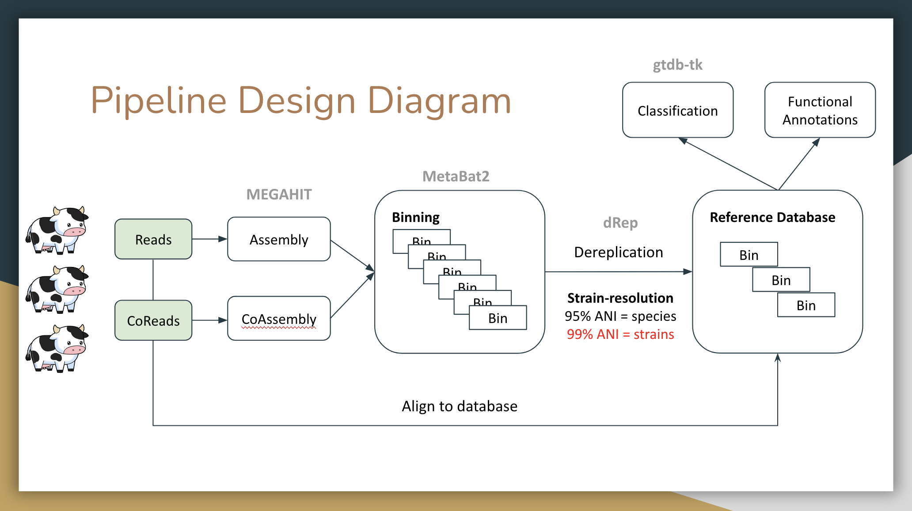
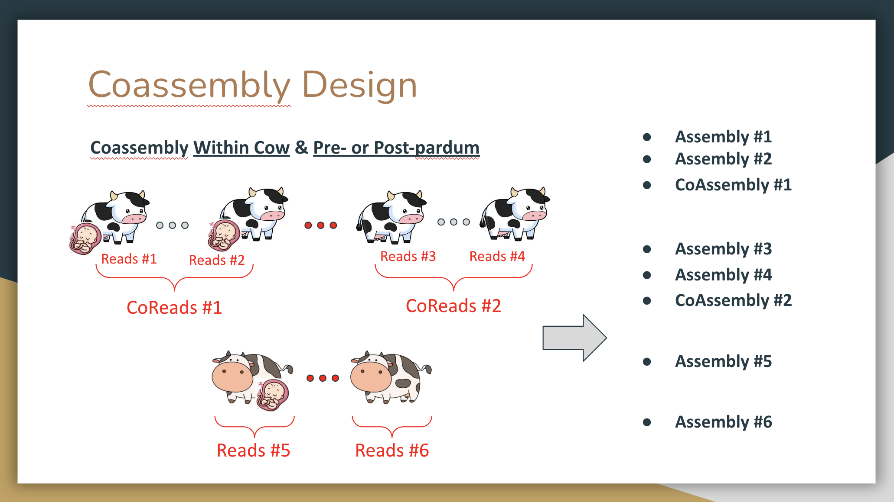

# OREI Teat Shotgun Metagenomics AMR Analysis

A repo dedicated to metegenome/resistome analyses of Shotgun sequencing of teat swabs of primiparous organic cows from four Farms, with some of the cows testing positive for Staphyloccocus aureus infection.

## Metagenome-assembled Genomes & Strain Analysis:
 - Strain-resolved MAG workflow being developed in strain_analysis
 - Currently completed all assembly + coassembly, need to complete binning
 
### Bioinformatic Workflow Overview
  
  **MAG Pipeline:** Assembly + Coassembly is done with MEGAHIT. Then binning is done with MetaBat2 (MaxBin, CONCOCT, and DasTool in the future). Dereplication at 99% ANI is performed with dRep to create a study-wide database of strain-resolved MAGs. Classifications and functional annotations are then assigned to these MAGs. Finally the individual reads and CoReads will be aligned to this database from strain-resolved analyses.

 
  **Coassmbly Design:** CoReads are created for all samples within a cow before or after calving. Coassemblies are then generated from these CoReads and individual assemblies from individual readsets. 

## AMR Analyses
- AMR Classification relative abundance barplot
- Principal Components Analysis (visualizing cow health statuses)
- **PERMANOVA Testing**
  - Days in Milk, S. aureus infection, Batch effects
- Time Series Differential Abundance (metagenomeseq) _WIP_
- **AMR Differential Abundance Testing** (ALDEX2)

&nbsp;

## Refer to OREI_Calfs_Report.pdf for AMR analysis Figures!
